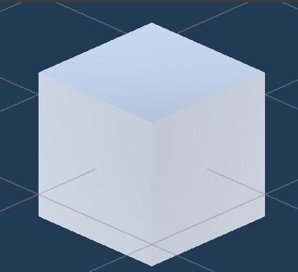

# Hello World

This is an example webpage created through a _Framework_!

```js
const cube = await FileAttachment("./img/cube.png").image({width:300});
display(cube);
```

<div class="some-formatted-html">${cube}</div>
<div class="some-formatted-html"></div>

<style>
    .some-formatted-html {
        display: inline-block;
        width:200px;
    }
</style>